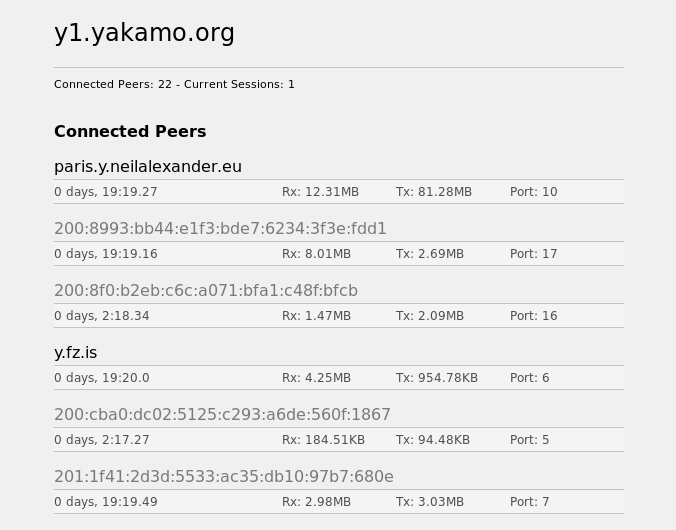

# yggdrasil-stats

  

Yggdrasil-stats is for displaying connected peers and ongoing sessions in a pretty format.  

This works with Version 0.2.7, if you want it to work with v0.3 make sure AdminListen is set to:  

    tcp://localhost:9001

### gen-stats.py 

Just add to crontab and run once an hour:  
*/1 * * * * python ygg-stats.py  

Make sure to change in the program 'root_dir = "/var/www/" ' to where you want index.html to be saved. Don't forget to save style.css in the same folder that the index.html will live.  

### ygg-stats.php

This is simpler if you have an already php friendly enviroment setup on your server, just drop ygg-stats.php into your desired location with style.css and it will work as is.  

### fetching nodelist

Yggdrasil stats will make a request to a [nodelist](https://github.com/yakamok/yggdrasil-nodelist) to check if there are domains assotiated with the ipv6 address and show it instead, you can add your own for your ipv6 address by forking the repo and making a pull request with your change(s).  

### css-themes

There is the deafult style.css that comes with yggdrasil-stats and there is a folder of custom themes. If your interested in creating themes for the stats page your welcome to submit a pull request to have your theme added, please use the following naming convention:  

        style-themename-username.css
        
When you download the theme of your choice and place it in the same folder as index.php rename it to style.css, or rename it in index.php to match.  

### ToDo:

add unix socket support  
add api for domain support  

